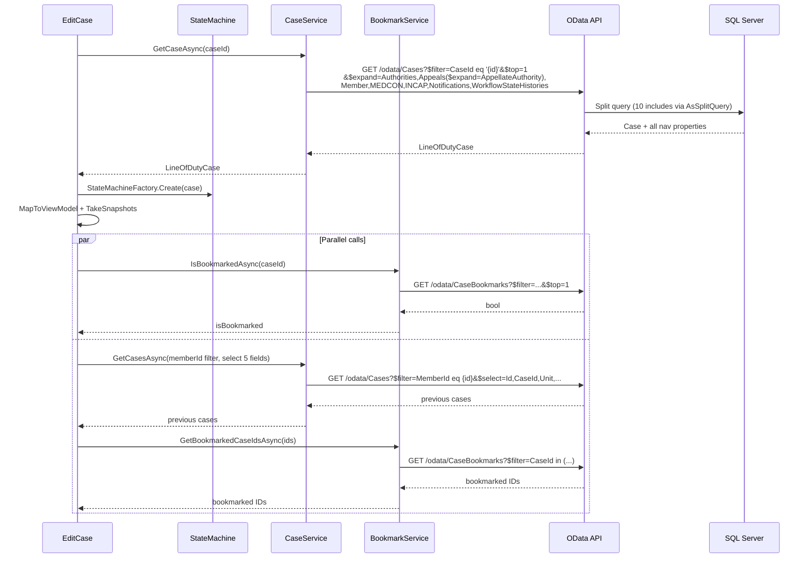
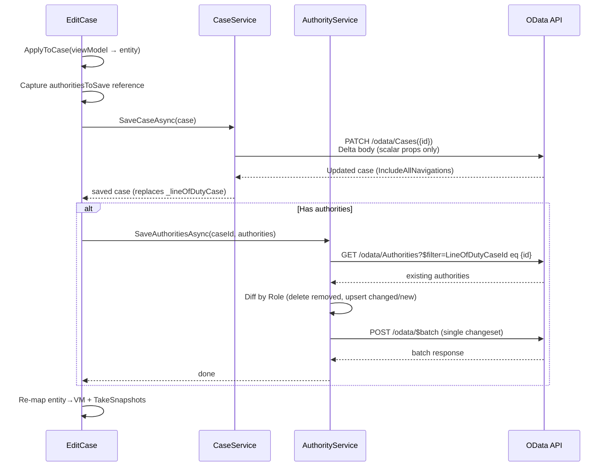
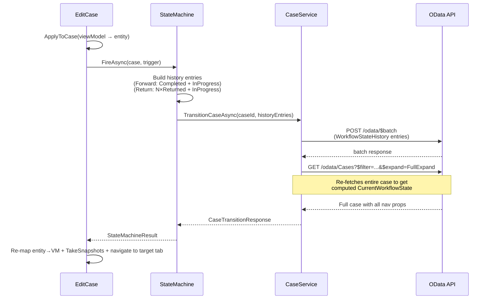
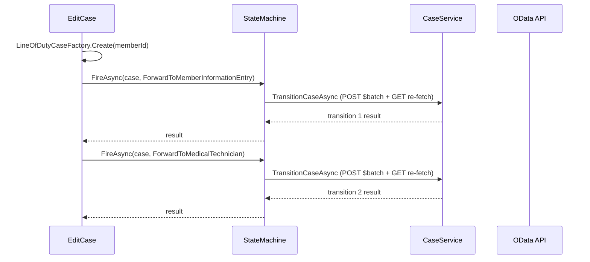

# Part 1: Call Sequence Analysis

## 1A. Initial Case Load (`LoadCaseAsync`)

**Total: 4 HTTP calls** (1 case+expand, 1 bookmark check, 1 previous cases, 1 bookmarked IDs)

## 1B. Save Tab Data (`SaveTabFormDataAsync`)

**Total: 2–3 HTTP calls** (1 PATCH, 1 GET existing authorities, 1 $batch upserts)

## 1C. Workflow Transition (`FireWorkflowActionAsync` → state machine)

**Total: 2 HTTP calls** (1 $batch history, 1 full case re-fetch)

## 1D. New Case Creation (`OnMemberForwardClick`)

**Total: 4 HTTP calls** (2 $batch + 2 re-fetches) — the double transition moves the case from Draft → MemberInformationEntry → MedicalTechnicianReview

## 1E. Tab-Specific Lazy Loads

| User Action | HTTP Calls | Detail |
|---|---|---|
| **Tracking tab** (first click) | **0** | Uses preloaded `WorkflowStateHistories` from initial `$expand` (`_trackingPreloaded = true`) |
| **Tracking tab** (search/page) | **1** | `GET /odata/WorkflowStateHistories?$filter=...&$orderby=...&$top=...&$skip=...&$count=true` |
| **Previous Cases grid** (page) | **2** | `GET /odata/Cases?$filter=MemberId eq ...&$select=...` + `GET /odata/CaseBookmarks?$filter=...` |
| **Documents grid** (page) | **1** | `GET /odata/Cases({id})/Documents?$filter=...&$top=...&$skip=...&$count=true` |
| **Document download** | **1** | `GET /api/document-files/{docId}` (REST, not OData) |
| **Document upload** | **1** | `POST /api/document-files/{caseId}` (REST multipart) |
| **AF Form 348 PDF** (tab click) | **1** | `GET /api/document-files/{caseId}/form348` (lazy, one-time) |
| **Bookmark toggle** | **1–2** | `POST/DELETE /odata/CaseBookmarks` + `BookmarkCountService.RefreshAsync()` |
| **Member search** | **1** | `GET /odata/Members?$filter=contains(...)&$top=10` (300ms debounced) |
| **Check-in** | **1** | `POST /odata/Cases({id})/Checkin` |

## 1F. Complete Call Inventory (Typical Edit Session)

| Phase | Calls | Cumulative |
|---|---|---|
| Initial load | 4 | 4 |
| Apply Changes (save) | 3 | 7 |
| Forward to next step | 2 | 9 |
| (optional re-load after navigation) | 4 | 13 |
