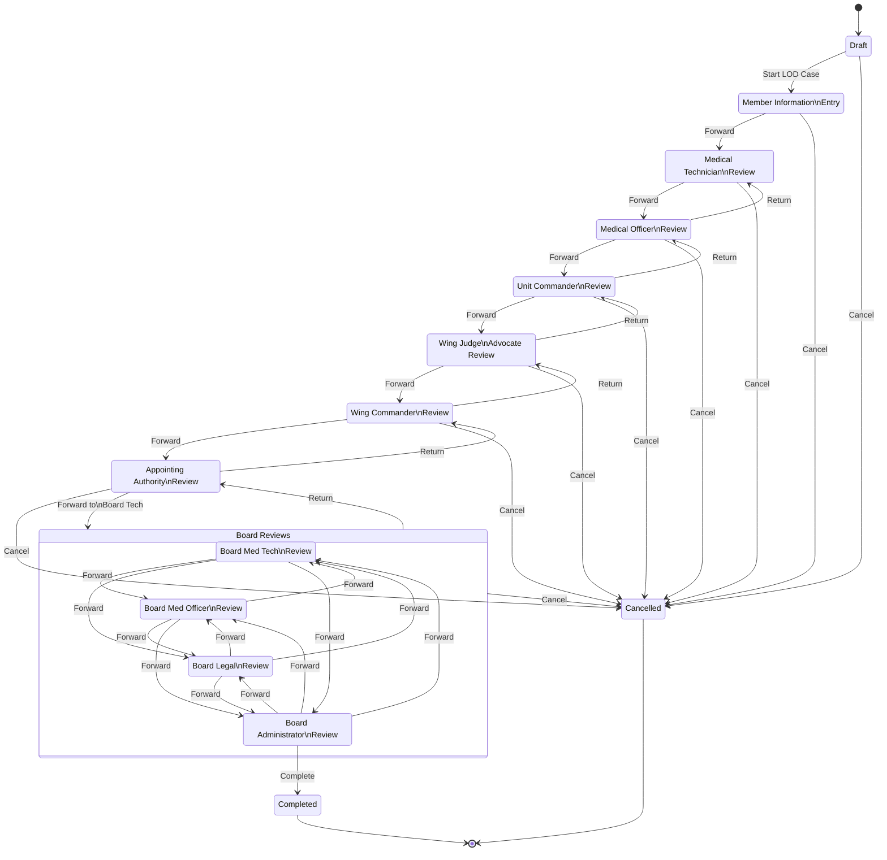

# LOD Case Workflow State Machine

## Workflow Overview

| Step | State | Forward To | Can Return? |
| --- | --- | --- | --- |
| 0 | Draft | Member Information Entry | No |
| 1 | Member Information Entry | Medical Technician Review | No |
| 2 | Med Tech Review | Medical Officer Review | Yes (Return trigger) |
| 3 | Medical Officer Review | Unit Commander Review | Yes |
| 4 | Unit Commander Review | Wing Judge Advocate Review | Yes |
| 5 | Wing Judge Advocate Review | Wing Commander Review | Yes |
| 6 | Wing Commander Review | Appointing Authority Review | Yes |
| 7 | Appointing Authority Review | Board Med Tech Review | Yes |
| 8 | Board Med Tech Review | Board Med/Legal/Admin (lateral) | Yes |
| 9 | Board Medical Officer Review | Board Tech/Legal/Admin (lateral) | Yes |
| 10 | Board Legal Review | Board Tech/Med/Admin (lateral) | Yes |
| 11 | Board Administrator Review | Completed (terminal) | Yes |

## Key Behaviors

- **Sequential pipeline (Steps 0–7):** Each step forwards to the next in order.
- **Board lateral routing (Steps 8–11):** Any board reviewer can forward to any
  other board reviewer.
- **Return trigger:** Dynamic — from Steps 2+ the case can be returned to _any_
  earlier stage via `PermitDynamicIf`.
- **Cancel trigger:** Available from all 12 non-terminal states; transitions to
  Cancelled.
- **Terminal states:** Completed and Cancelled silently ignore further Cancel
  triggers.
